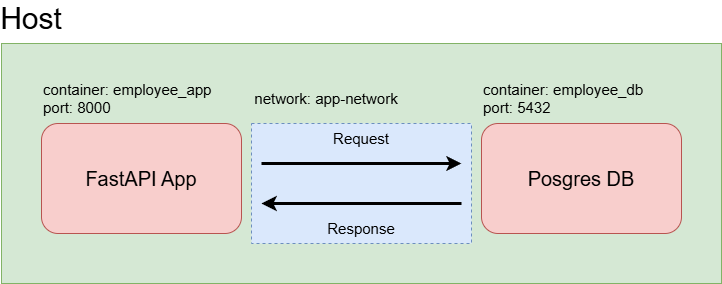

# FastAPI App Example

## How to run

### 1. Build Docker Image

```docker
docker build -t employee-posgres:latest -f posgres-dockerfile .

docker build -t fastapi-employee -f fastapi-dockerfile .
```

### 2. Docker Compose Posgres

```docker
docker compose -f posgres-compose.yaml up
```

### 3. Docker Compose FastAPI App

```docker
docker compose -f fastapi-compose.yaml up
```

## Architecture

